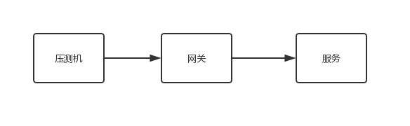
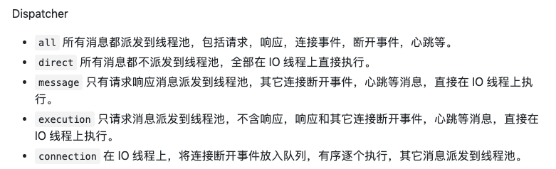

## 背景
因为在前一家公司负责过网关项目。最近，前同事找到我，寻求我的帮助。他压测的时候发现网关的qps只能到1.5w。通过jstack命令发现，阻塞点在netty的线程池。我们的网关采用async servlet + dubbo异步调用 + dubbo事件通知的形式做到非阻塞io模型。

我通过询问得知，他们的压测模型如下：

## 为什么阻塞点在netty线程池
### 1. dubbo的编解码与线程池策略无关
dubbo的线程池策略有4种。如下：

初看时，容易让人误以为，读写时包含编解码的。实际上，看了源码就知道。dubbo client端和server端，编解码是与线程池策略无关的。

dubbo的线程池策略是什么。为什么netty的线程需要执行编解码操作。并且一个channel是与一个eventloop（线程）绑定的。